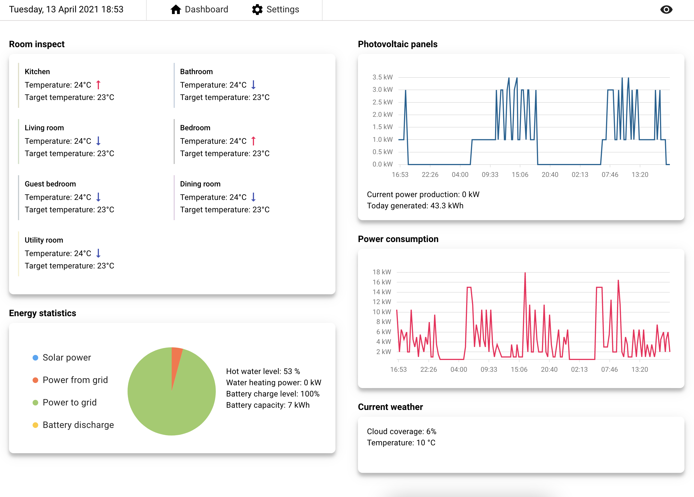
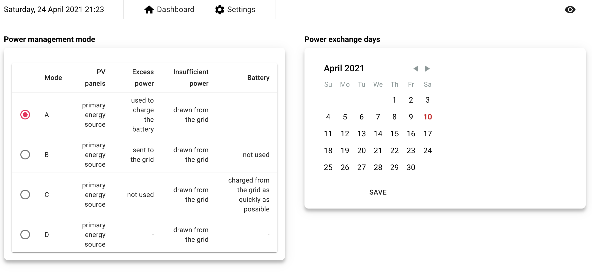
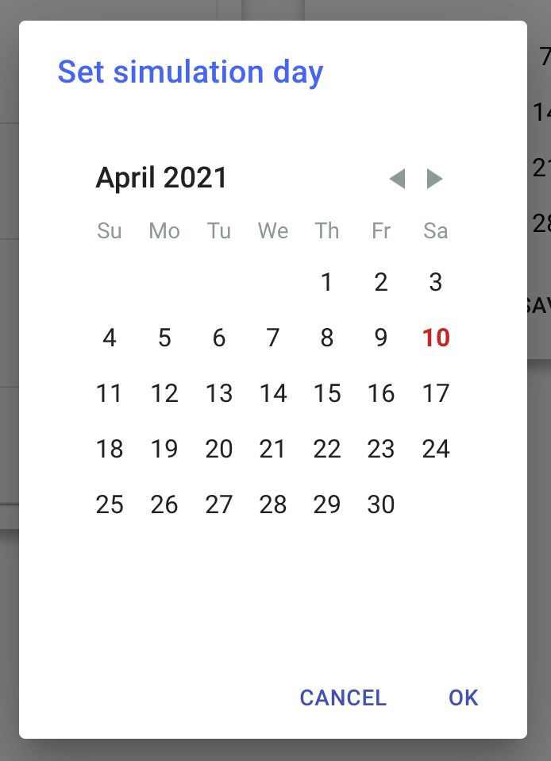

# Smart home manager

Aplikacja zarządza nowoczesnym budynkiem wyposażonym w czujniki.

Strona back-endowa symuluje budynek w pamięci. Kalkulacje wykonywane są co tick (10 minut w symulacji). Strona dysponuje możliwością zmiany symulowanego dnia w kalendarzu (poniżej).

System jest zaprogramowany, aby temperatury w pokojach były jak najbardizej zbliżone do temperatury docelowej.

## Główne funkcjonalności

### Podgląd pokoi

Pozwala na sprawdzenie temperatury w pokojach oraz na stan grzania.

- `↑` - pokój jest ogrzewany w danym momencie
- `↓` - pokój nie jest ogrzewany.

### Statystyki paneli fotowoltaicznych

Wykres ilustruje produkcję energii elektrycznej z paneli rozłożoną w czasie.

### Statystyki konsumpcji energii

Wykres ilustruje łączne zapotrzebowanie na energię rozłożone w czasie.

### Statystyki energii

Informacje o rozkładzie energii w systemie, zbiorniku wody oraz stanie akumulatora. Pozwala na podgląd działania ustawionego trybu zarządzania energią.

### Informacje o pogodzie

Aktualne informacje z czujników zewnętrznych.

### Ustawienia

#### Wybór trybu zarządzania energią

#### Wybór dni do rozliczania na zasadzie "Teraz oddaję, kiedy indziej pobiorę"
